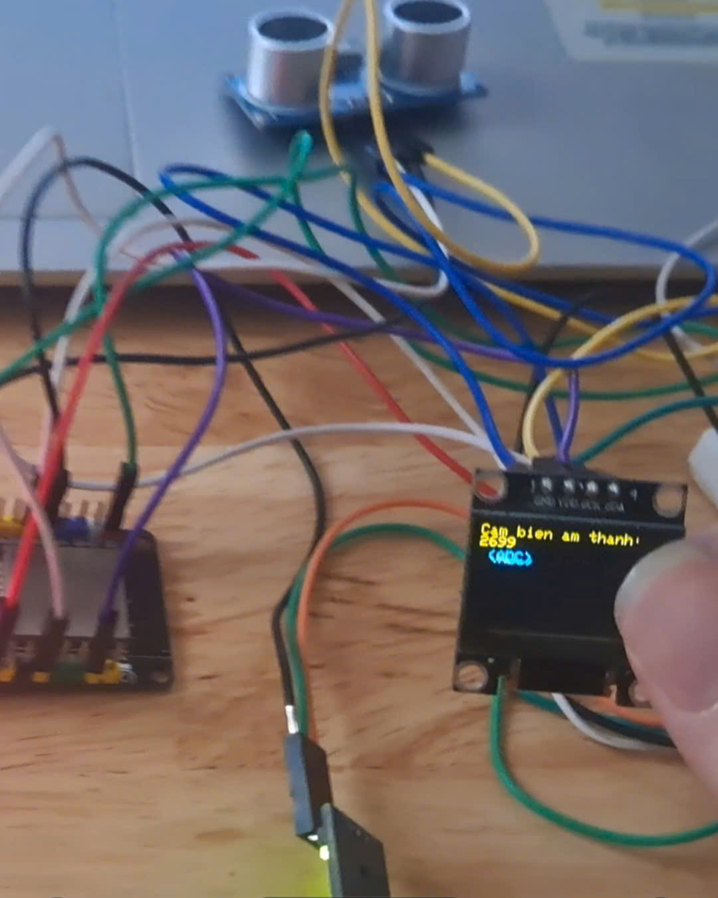
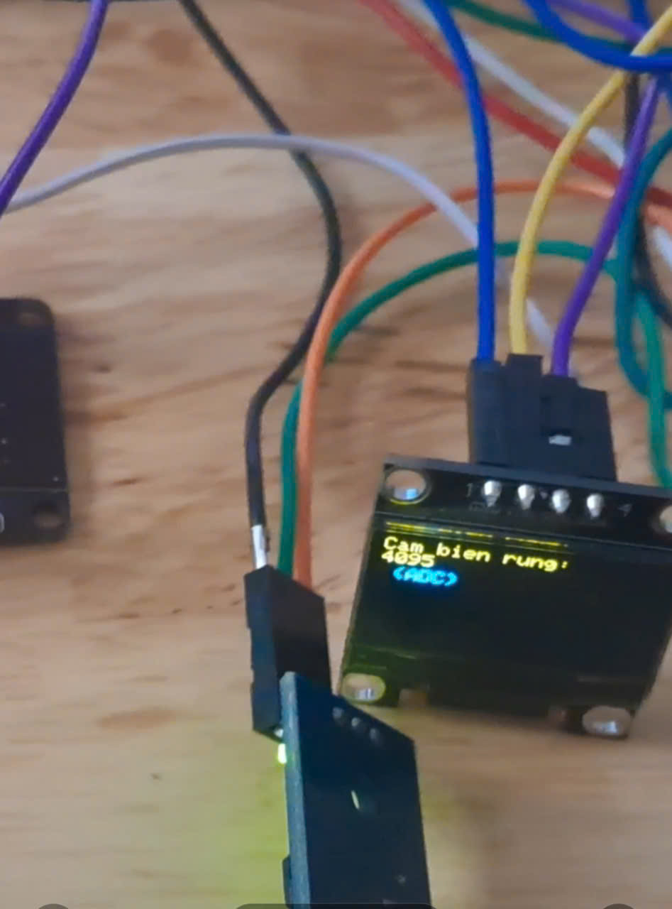
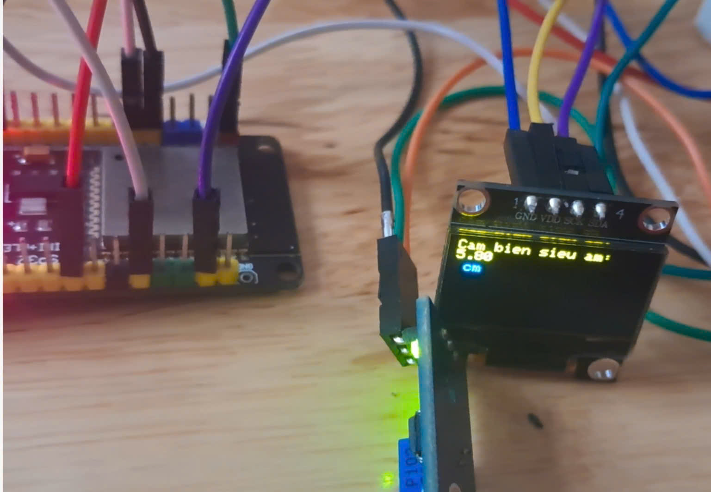
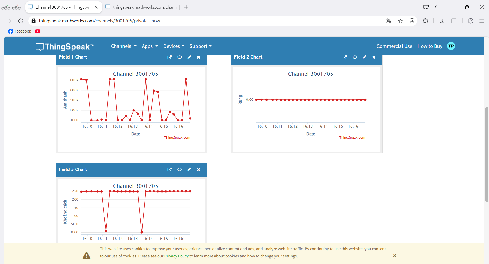
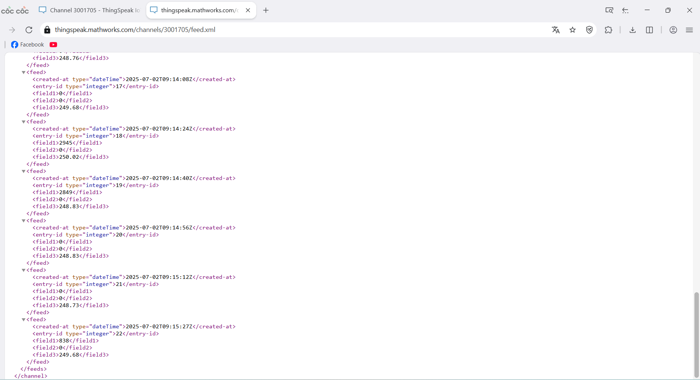

# PROJECT II

## GIỚI THIỆU

__Đề bài__: Thiết kế và xây dựng thiết bị tích hợp cảm biến đo dao động cơ học, âm thanh và khoảng cách bằng siêu âm

__Sản phẩm:__
1. Đo cường độ âm thanh từ môi trường xung quanh bằng cảm biến âm thanh
2. Phát hiện rung động cơ học (va chạm, rung nhẹ) bằng cảm biến rung
3. Đo khoảng cách đến vật thể phía trước bằng cảm biến siêu âm
4. Hiển thị dữ liệu thời gian thực trên màn hình OLED
5. Chuyển chế độ hiển thị bằng nút bấm (âm thanh → rung → khoảng cách)
6. Gửi dữ liệu lên nền tảng IoT ThingSpeak để theo dõi từ xa qua internet
- Ảnh chụp minh họa:\
  
  
  
  
## TÁC GIẢ

- Trần Duy Phúc - 20225378
- Giảng viên hướng dẫn: Ths. Nguyễn Đức Tiến

## MÔI TRƯỜNG HOẠT ĐỘNG

- Module vi điều khiển sử dụng:
ESP32 DEVKIT

- Các module/kit cảm biến được sử dụng:
Cảm biến âm thanh (Sound sensor module, ngõ ra analog)
Cảm biến rung (Vibration sensor module, ngõ ra analog)
Cảm biến siêu âm HC-SR04 (dùng đo khoảng cách)
Màn hình OLED 0.96 inch I2C (SSD1306, độ phân giải 128x64)
Nút nhấn (Button – sử dụng để chuyển chế độ)
Dây nối (jumper wire), Breadboard

- Chuẩn giao tiếp:
Giao tiếp I2C: dùng kết nối ESP32 với màn hình OLED
Giao tiếp digital và analog: đọc dữ liệu từ cảm biến
Giao tiếp WiFi: kết nối mạng và gửi dữ liệu lên ThingSpeak

- Phần mềm sử dụng:
Arduino IDE với board "ESP32 Dev Module"
Trình duyệt web (xem dữ liệu trên trang web ThingSpeak)


## SO ĐỒ SCHEMATIC

_Cho biết cách nối dây, kết nối giữa các linh kiện_ 

| ESP32 DevKit V1 | Thiết bị / Module        | Ghi chú                            |
|-----------------|--------------------------|------------------------------------|
| GPIO18          | Nút bấm                  | INPUT_PULLUP, nối với GND khi nhấn |
| GPIO34          | Cảm biến âm thanh        | Đọc giá trị ADC                    |
| GPIO35          | Cảm biến rung            | Đọc giá trị ADC                    |
| GPIO13          | HC-SR04 - TRIG           | Phát xung siêu âm                  |
| GPIO12          | HC-SR04 - ECHO           | Nhận xung phản hồi                 |
| GPIO21          | OLED - SDA               | Giao tiếp I2C                      |
| GPIO22          | OLED - SCL               | Giao tiếp I2C                      |
| 3V3             | VCC các module           | Cấp nguồn                          |
| GND             | GND các module           | Nối đất chung                      |


### TÍCH HỢP HỆ THỐNG
_Mô tả các thành phần phần cứng và vai trò của chúng:
| Thiết bị phần cứng      | Vai trò                                                                 |
|-------------------------|-------------------------------------------------------------------------|
| ESP32 DevKit            | Vi điều khiển trung tâm, xử lý dữ liệu cảm biến, hiển thị, gửi dữ liệu |
| Cảm biến âm thanh       | Gửi tín hiệu analog về ESP32 để đo mức độ âm thanh                     |
| Cảm biến rung           | Gửi tín hiệu analog về ESP32 khi phát hiện chấn động                   |
| Cảm biến siêu âm HC-SR04| Đo khoảng cách, giao tiếp với ESP32 qua TRIG và ECHO                   |
| Màn hình OLED SSD1306   | Hiển thị dữ liệu cảm biến, giao tiếp I2C với ESP32                     |
| Nút nhấn GPIO           | Điều khiển chuyển chế độ hiển thị dữ liệu trên màn hình OLED           |
| WiFi Router             | Kết nối mạng, giúp ESP32 gửi dữ liệu lên ThingSpeak                    |

_Mô tả các thành phần phần mềm và vai trò của chúng, vị trí nằm trên phần cứng nào:
| Phần mềm           | Vai trò                                                                 | Chạy trên         |
|--------------------|-------------------------------------------------------------------------|-------------------|
| Firmware Arduino   | Thu thập dữ liệu, xử lý, hiển thị, gửi HTTP request lên ThingSpeak      | ESP32 DevKit      |
| Serial Monitor     | Quan sát dữ liệu cảm biến dạng text để kiểm tra và debug                | Máy tính cá nhân  |
| ThingSpeak         | Nhận và lưu trữ dữ liệu, hiển thị dữ liệu cảm biến theo biểu đồ thời gian| Nền tảng Cloud    |


### ĐẶC TẢ HÀM

- Giải thích một số hàm quan trọng: ý nghĩa của hàm, tham số vào, ra

  ```C
      Các hàm của phần hiển thị màn hình OLED (tích hợp 3 cảm biến)
      /**
       * Khởi tạo màn hình OLED SSD1306, kiểm tra kết nối, và hiển thị thông báo "Khoi dong..."
       * Không có tham số vào. 
       * Không trả về giá trị.
       */
    void setup(); // thuộc chương trình hiển thị

      /**
       * Vòng lặp chính của chương trình. Thực hiện:
       * - Đọc nút nhấn để chuyển chế độ hiển thị (âm thanh, rung, siêu âm)
       * - Đọc giá trị cảm biến tương ứng
       * - Cập nhật lịch sử hiển thị (dành cho chế độ hiển thị dạng cuộn)
       * - Hiển thị kết quả ra màn hình OLED (có thể theo 2 chế độ ghi đè hoặc dạng cuộn) và Serial Monitor
       * Không có tham số vào.
       * Không trả về giá trị.
       */
      void loop(); // thuộc chương trình hiển thị


      Các hàm của phần gửi dữ liệu lên ThingSpeak:
      /**
       * Khởi động Serial, cấu hình chân cảm biến, kết nối WiFi.
       * Không có tham số vào.
       * Không trả về giá trị.
       */
      void setup(); // thuộc chương trình gửi dữ liệu lên ThingSpeak

      /**
       * Đọc dữ liệu từ 3 cảm biến, hiển thị ra Serial Monitor.
       * Gửi dữ liệu lên ThingSpeak qua HTTP GET nếu kết nối WiFi thành công.
       * Không có tham số vào.
       * Không trả về giá trị.
       */
      void loop(); // thuộc chương trình gửi dữ liệu lên ThingSpeak

      /**
       * Đo khoảng cách bằng cảm biến siêu âm HC-SR04.
       * @return Khoảng cách tính bằng cm (kiểu float).
       */
      float doKhoangCach(); // thuộc chương trình gửi dữ liệu lên ThingSpeak

  ```
  
### KẾT QUẢ
- Hiển thị ghi đè  
  👉 [Xem video](https://drive.google.com/file/d/1cf-DTUFXaE5r25L_yNLNIQVTNnAJTs2R/view?usp=sharing)

- Hiển thị dạng cuộn  
  👉 [Xem video](https://drive.google.com/file/d/1rIetL2tfgs_0Dhsynz50p1_0dH6n26Y4/view?usp=sharing)

- Hiển thị lên Serial Plotter  
  👉 [Xem video](https://drive.google.com/file/d/1m8An9j3NIMtHY0W7rZprZ3zhEe0h22W5/view?usp=sharing)

- Hiển thị lên ThingSpeak
  
  👉 [Xem video](https://drive.google.com/file/d/1wLaAnkgSSwyq5mvIBFiS86uKQTJ_WTW3/view?usp=sharing)

- Lịch sử lưu trữ dữ liệu thingspeak

